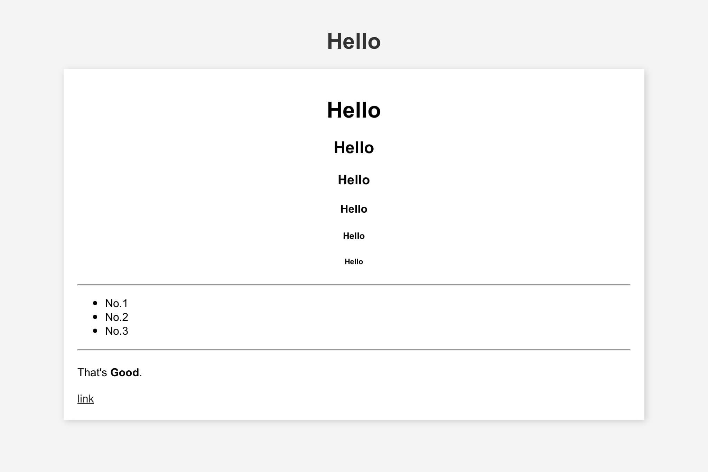

# beautiful-html
Make the simple html skeleton beautiful



## How to use

```
<html>

<head>
	<meta charset="utf-8">
	<title>title</title>
	<link rel="stylesheet" href="./main.css">
</head>

<body>
	<h1 class="title">title</h1>
	<div class="main">
		Put html text here.
	</div>
</body>

</html>
```
